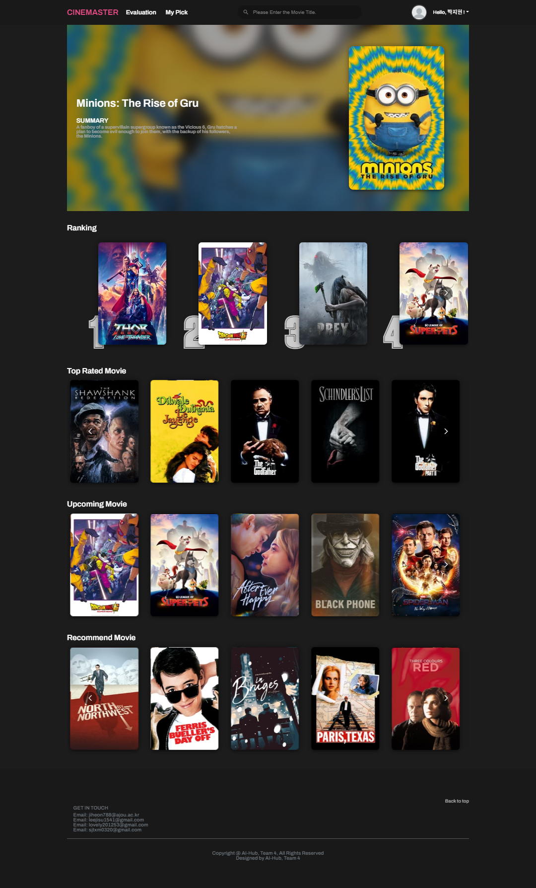
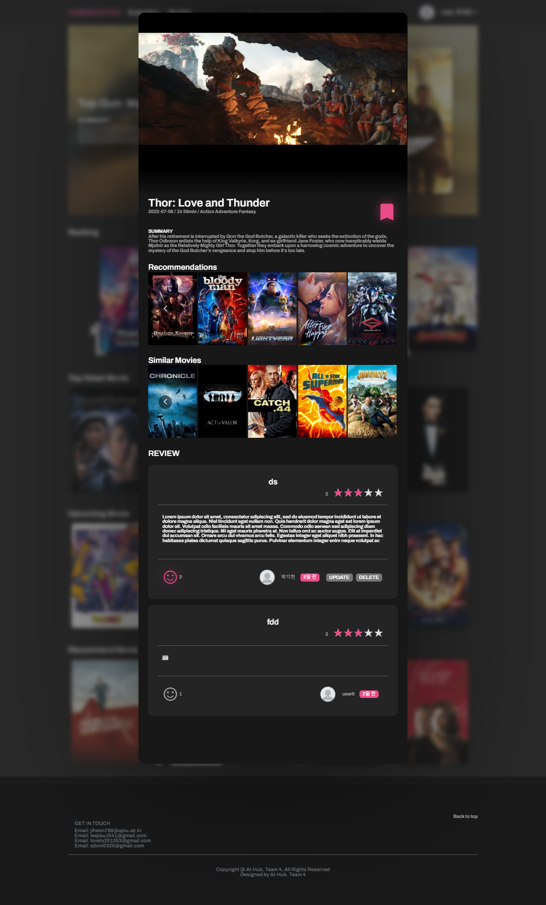
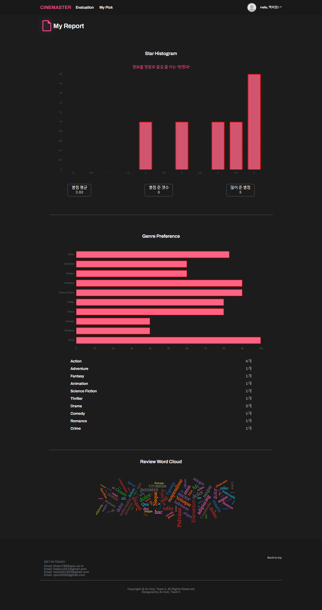
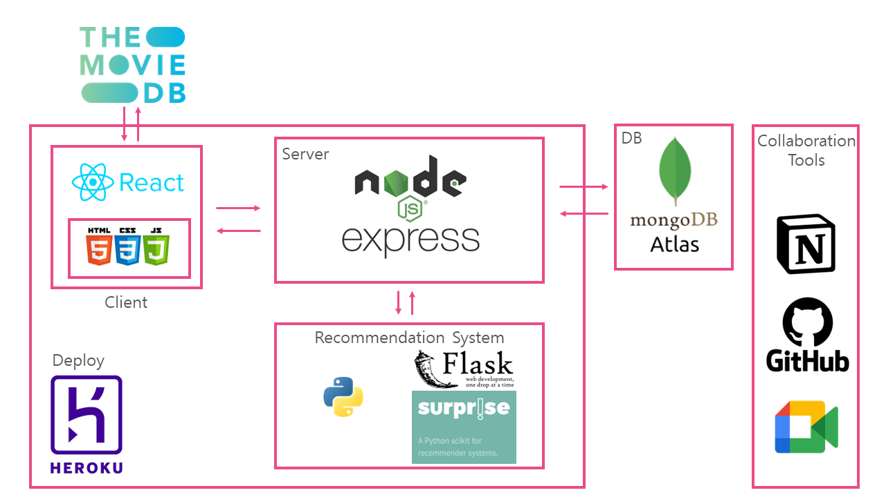

<h1>
CINEMATER  
영화추천서비스 + 영화 리뷰 커뮤니티 

</h1>

[https://cinemaster-four.herokuapp.com/](https://cinemaster-four.herokuapp.com/)

       

|Github|Part|
|------|---|
|@jiheon788|FE / DESIGN|
|@jisulee42|BE / 배포|
|@Hyyena|PM / BE / RS|

 

## 시스템 구조
AI HUB - 인공지능 웹 개발 트랙에서 진행한 프로젝트의 프론트엔드 파트를 담당하였다. 시스템 구조는 아래와 같다.

 

기능은 다음과 같다.
* 회원가입 / 로그인 / 카카오톡, 네이버 SNS 로그인
* 회원 프로필관리/ 작성리뷰 관리 / 찜기능 
* 유저 작성 리뷰 기반 유저 취향 분석 레포트 기능 (별점분포도, 장르선호도 분석, 리뷰워드클라우드)
* 평가하기 - 평점기반 추천서비스
* 영화정보모달 (유튜브 트레일러, 영화정보, 장르기반추천 서비스, 유저기반추천 서비스)
* 리뷰 CRUD (별점 및 리뷰 추천기능)
* 영화검색

### Home.js ('/')
* Redux를 사용하여 TMDB에서 박스오피스랭킹, 상위평점영화, 개봉예정작 영화리스트를 받아온다. 
* 박스오피스 랭킹 리스트에서 랜덤한 영화를 Banner 컴포넌트에 전달한다.
* 영화의 리스트는 MovieSlide 컴포넌트로 전달
* 랭킹리스트의 구별을 의해 isRanking props를 정의

### MovieSlide.js ('/')
* react-multi-carousel 사용
* 영화리스트를 map함수를 사용해 개별적인 MovieCard를 만들어 케러셀로 출력해줌
* isRanking 인자가 있는 경우 인덱스번호로 랭킹순위도 출력

### MovieCard.js ('/')
* 각 카드에는 movie_id값이 들어있다.
* MovieModal 컴포넌트 - 카드 클릭시 isOpen stat값이 true로 바뀌어 모달출력
* movie_id 값을 props로 전달
* jquery를 사용하여 모달 외 부분 스크롤방지, 케러셀 버튼 숨김처리

### MovieModal.js ('/')
* react-modal 사용
* props로 들어온 movie_id값을 state로 정의해주었다. 모달 내에서 다른 영화 바뀔시 하나의 모달내에서 내용 변경
* 컨텐츠들을 모두 컴포넌트로 정의해주었다. id state를 각 컴포넌트에 전달해 영화가 바뀔때마다 해당하는 데이터를 출력한다.
> 기존에는 리덕스에서 받아온 영화 정보로 MovieModal컴포넌트에서 모든 통신을 하였다. 하지만 modal은 홈에 60개의 카드가 있으면 해당 모달이 열리면서 정보를 가져오는게 아닌 홈화면을 렌더링하면서 모든 데이터를 받아온다. 여기에서 불필요한 통신이 반복되며 속도가 저하됨. 이를 해결하기 위해 각 컨텐츠 별로 컴포넌트를 만들어 줌으로써 홈화면 렌더링시 모든 모달이 set되기는 하나 필요한 컨텐츠는 모달이 열릴떄만 진행하게됨 

* 모달 내 컨텐츠(컴포넌트)는 다음과 같다.
  - MovieTrailer
    1. 영화아이디를 tmdb API에 보내 관련 영상들의 리스트를 가져온다.
    2. 비디오 타입이 Trailer인 영화를 찾아 Trailer Key값을 set 한다. 
    3. trailerKey값으로 유튜브 url을 정의해준다.
    4. iframe 태그 사용하여 영상 출력(parameter로 영상 옵션 조절)
  - MovieIntroduction
    1. 영화아이디를 tmdb API에 보내 영화의 디테일 정보를 가져온다.
    2. orginal title, release date, runtime, genre || tagline
    3. Bookmark 컴포넌트
      + 렌더링시 유저의 찜목록을 디비에서 가져와 해당영화가 있는지 검사
      + 북마크아이콘 클릭시 토글형태로 백엔드와 통신함
  - GetRecommendations, GetSimilarMovies
    1. 영화아이디를 tmdb API에 보내 각각 유저기반 추천, 장르기반추천 영화 리스트를 가져옴
    2. 케러셀을 사용하여 이미지 띄어준다.
    3. 클릭시 movidId State를 변경하여 모달의 컨텐츠 내용 변경
    > 기존에는 새로운 모달을 띄워줬으나 모달이 계속하여 쌓이면서 속도저하 & UI 개선을 위해 movidId State 변경으로 수정하였다.
  - Reviews
    1. 서버에 영화아이디를 보내 해당영화의 리뷰리스트를 받는다.
    2. 리뷰리스트에서 사용자가 작성한 리뷰가 있는지 검사하여 작성권한을 변경해준다.
    3. 작성권한이 트루(로그인o, 작성글존재x)이면 리뷰작성버튼 출력
    4. 리뷰리스트를 map함수로 하나씩 ReviewCard 만들어줌.
      + 사용자의 좋아요, 내가 작성한 글인지 boolean 값으로 정의
      + 리뷰카드는 모달, 작성글목록에서 사용된다. 리뷰는 사용자기준, 영화기준 두가지에 따라 서버에서 가져오는 루트가 다르다.
      + 수정,삭제, 좋아요에 따라 리뷰를 다시 가져오는 통신을 해야하는데 두가지 통신방법이 다르기에 모달에서만 해당작업이 가능하도록함 (accessType props로 접근경로 찾음)

### MyReport.js ('/myreport')
 * 유저기반 작성글 리스트를 불러온다. 작성한 리스트가 없으면 레포트기능 사용불가
 * chart.js를 사용하여 별점분포도, 장르선호도를 분석하여 시각화해준다.
 * 가져온 리스트에서 작성한 리뷰의 컨텐트만 하나의 문자열로 합쳐 워드클라우드를 만들어 주었다. (react-wordcloud 사용)
 * 현재 가중치를 랜덤하게 주었다. 문자열의 빈도수에 따라 가중치를 주기 위해서는 파이썬서버에서 워드클라우드를 만들어 이미지만 전달해주는 방식으로 수정해야 할것으로 보인다.
